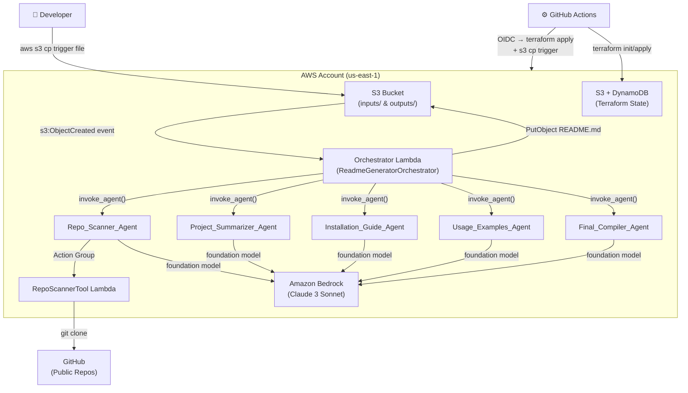
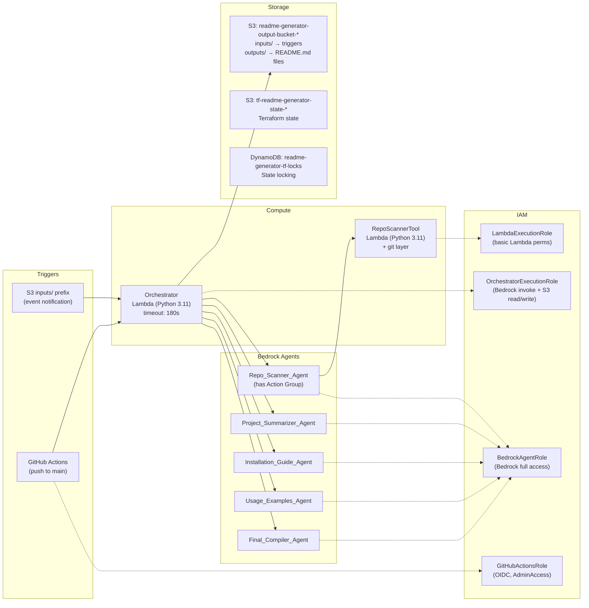
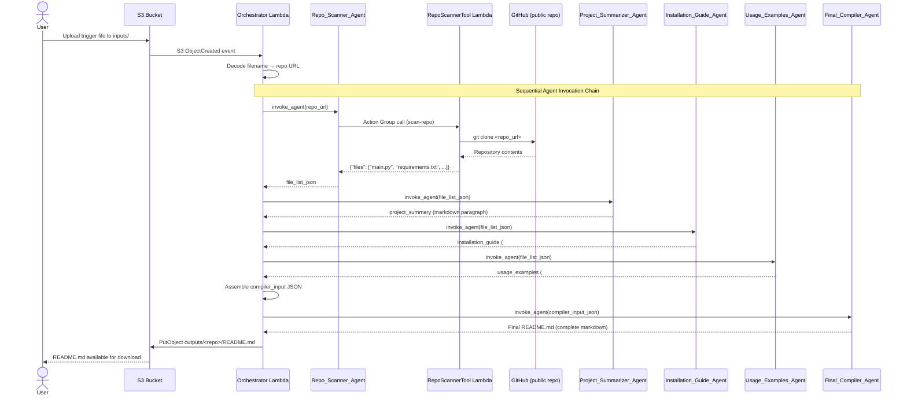

# Architecture Diagrams — AI README.md Generator

## System Context Diagram

```mermaid
graph TD
    DEV["👤 Developer"]
    GHA["⚙️ GitHub Actions"]

    subgraph AWS["AWS Account (us-east-1)"]
        S3["S3 Bucket<br/>(inputs/ & outputs/)"]
        ORCH["Orchestrator Lambda<br/>(ReadmeGeneratorOrchestrator)"]
        RS_AGENT["Repo_Scanner_Agent"]
        RS_LAMBDA["RepoScannerTool Lambda"]
        PS_AGENT["Project_Summarizer_Agent"]
        IG_AGENT["Installation_Guide_Agent"]
        UE_AGENT["Usage_Examples_Agent"]
        FC_AGENT["Final_Compiler_Agent"]
        BEDROCK["Amazon Bedrock<br/>(Claude 3 Sonnet)"]
        TF_STATE["S3 + DynamoDB<br/>(Terraform State)"]
    end

    GITHUB["GitHub<br/>(Public Repos)"]

    DEV -->|"aws s3 cp trigger file"| S3
    GHA -->|"OIDC → terraform apply<br/>+ s3 cp trigger"| AWS
    S3 -->|"s3:ObjectCreated event"| ORCH
    ORCH -->|"invoke_agent()"| RS_AGENT
    ORCH -->|"invoke_agent()"| PS_AGENT
    ORCH -->|"invoke_agent()"| IG_AGENT
    ORCH -->|"invoke_agent()"| UE_AGENT
    ORCH -->|"invoke_agent()"| FC_AGENT
    RS_AGENT -->|"Action Group"| RS_LAMBDA
    RS_LAMBDA -->|"git clone"| GITHUB
    RS_AGENT & PS_AGENT & IG_AGENT & UE_AGENT & FC_AGENT -->|"foundation model"| BEDROCK
    ORCH -->|"PutObject README.md"| S3
    GHA -->|"terraform init/apply"| TF_STATE
```

## Container Diagram (Services & Data Stores)

```mermaid
graph LR
    subgraph Triggers
        T1["S3 inputs/ prefix<br/>(event notification)"]
        T2["GitHub Actions<br/>(push to main)"]
    end

    subgraph Compute
        L1["RepoScannerTool<br/>Lambda (Python 3.11)<br/>+ git layer"]
        L2["Orchestrator<br/>Lambda (Python 3.11)<br/>timeout: 180s"]
    end

    subgraph "Bedrock Agents"
        A1["Repo_Scanner_Agent<br/>(has Action Group)"]
        A2["Project_Summarizer_Agent"]
        A3["Installation_Guide_Agent"]
        A4["Usage_Examples_Agent"]
        A5["Final_Compiler_Agent"]
    end

    subgraph Storage
        S3_MAIN["S3: readme-generator-output-bucket-*<br/>inputs/ → triggers<br/>outputs/ → README.md files"]
        S3_STATE["S3: tf-readme-generator-state-*<br/>Terraform state"]
        DDB["DynamoDB: readme-generator-tf-locks<br/>State locking"]
    end

    subgraph IAM
        R1["LambdaExecutionRole<br/>(basic Lambda perms)"]
        R2["OrchestratorExecutionRole<br/>(Bedrock invoke + S3 read/write)"]
        R3["BedrockAgentRole<br/>(Bedrock full access)"]
        R4["GitHubActionsRole<br/>(OIDC, AdminAccess)"]
    end

    T1 --> L2
    T2 --> L2
    L2 --> A1 --> L1
    L2 --> A2
    L2 --> A3
    L2 --> A4
    L2 --> A5
    L1 -.-> R1
    L2 -.-> R2
    A1 & A2 & A3 & A4 & A5 -.-> R3
    T2 -.-> R4
    L2 --> S3_MAIN
```

## Core Workflow Sequence Diagram

```mermaid
sequenceDiagram
    actor User
    participant S3 as S3 Bucket
    participant Orch as Orchestrator Lambda
    participant RSA as Repo_Scanner_Agent
    participant RSL as RepoScannerTool Lambda
    participant GitHub as GitHub (public repo)
    participant PSA as Project_Summarizer_Agent
    participant IGA as Installation_Guide_Agent
    participant UEA as Usage_Examples_Agent
    participant FCA as Final_Compiler_Agent

    User->>S3: Upload trigger file to inputs/
    S3->>Orch: S3 ObjectCreated event
    Orch->>Orch: Decode filename → repo URL

    Note over Orch,FCA: Sequential Agent Invocation Chain

    Orch->>RSA: invoke_agent(repo_url)
    RSA->>RSL: Action Group call (scan-repo)
    RSL->>GitHub: git clone <repo_url>
    GitHub-->>RSL: Repository contents
    RSL-->>RSA: {"files": ["main.py", "requirements.txt", ...]}
    RSA-->>Orch: file_list_json

    Orch->>PSA: invoke_agent(file_list_json)
    PSA-->>Orch: project_summary (markdown paragraph)

    Orch->>IGA: invoke_agent(file_list_json)
    IGA-->>Orch: installation_guide (## Installation section)

    Orch->>UEA: invoke_agent(file_list_json)
    UEA-->>Orch: usage_examples (## Usage section)

    Orch->>Orch: Assemble compiler_input JSON
    Orch->>FCA: invoke_agent(compiler_input_json)
    FCA-->>Orch: Final README.md (complete markdown)

    Orch->>S3: PutObject outputs/<repo>/README.md
    S3-->>User: README.md available for download
```
