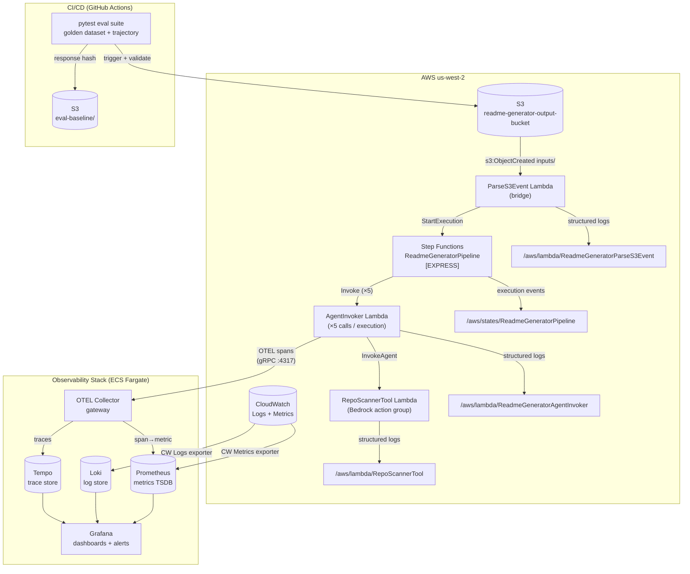
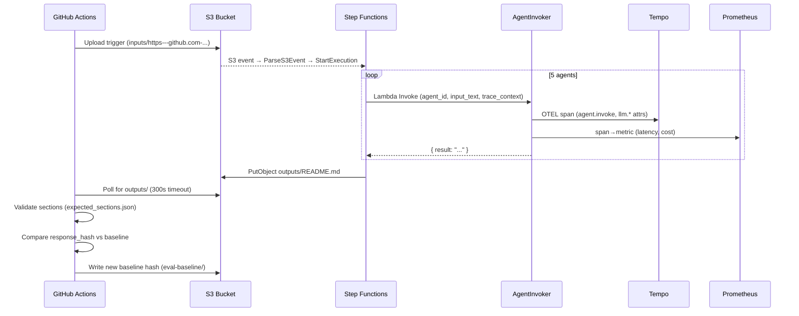

# Observability Architecture Diagrams — README Generator

---

## 1. Telemetry Context Diagram

Who emits what, and where it lands.



---

## 2. Trace Hierarchy (One SFN Execution)

How spans nest inside a single `./generate.sh` run.

```mermaid
gantt
    title Trace Timeline — Single README Generation
    dateFormat  ss.SSS
    axisFormat  %S.%Ls

    section ParseS3Event
    parse.s3_event (10ms)        : 0.000, 0.010

    section ScanRepo
    agent.invoke NE0CSDQPDP      : 0.010, 15.000

    section AnalyzeInParallel (concurrent)
    agent.invoke PHM7GVBXKT      : 15.000, 35.000
    agent.invoke VXXWEHVIBC      : 15.000, 33.000
    agent.invoke 2H19BVYH2V      : 15.000, 37.000

    section CompileReadme
    agent.invoke ODTFJA4DKP      : 37.000, 55.000

    section UploadReadme
    s3.putObject                 : 55.000, 55.500
```

**Span parent–child relationship** (Tempo TraceQL query):

```
{ span.sfn.trace_id = "<execution-name>" } | select(span.agent.id, span.llm.latency_ms, span.llm.cost_estimated_usd)
```

---

## 3. Sequence Diagram — CI/CD Eval Flow



---

## 4. Grafana Dashboard Layout

```
┌─────────────────────────────────────────────────────────────────┐
│  README Generator — Pipeline Overview                            │
├──────────────┬──────────────┬──────────────┬────────────────────┤
│ Executions/h │ Avg duration │ Error rate   │ Est. cost/run      │
│   [number]   │   [seconds]  │   [percent]  │   [USD]            │
├──────────────┴──────────────┴──────────────┴────────────────────┤
│  Agent Latency (p50 / p95 / p99) — line chart per agent_id      │
├─────────────────────────────────────────────────────────────────┤
│  Live Traces — Tempo panel (last 20 executions, trace explorer)  │
├─────────────────────────────────────────────────────────────────┤
│  Eval Signals                                                    │
│  output_nonempty rate  │  output_is_markdown rate  │  hash drift │
├─────────────────────────────────────────────────────────────────┤
│  CloudWatch Lambda Metrics (errors, throttles, duration)        │
│  ParseS3Event  │  AgentInvoker  │  RepoScannerTool              │
├─────────────────────────────────────────────────────────────────┤
│  Loki — log explorer (filter: agent_id, session_id, error)      │
└─────────────────────────────────────────────────────────────────┘
```
