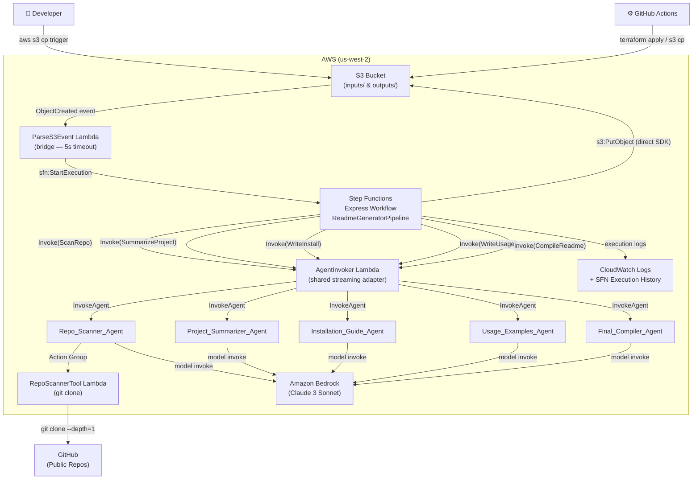
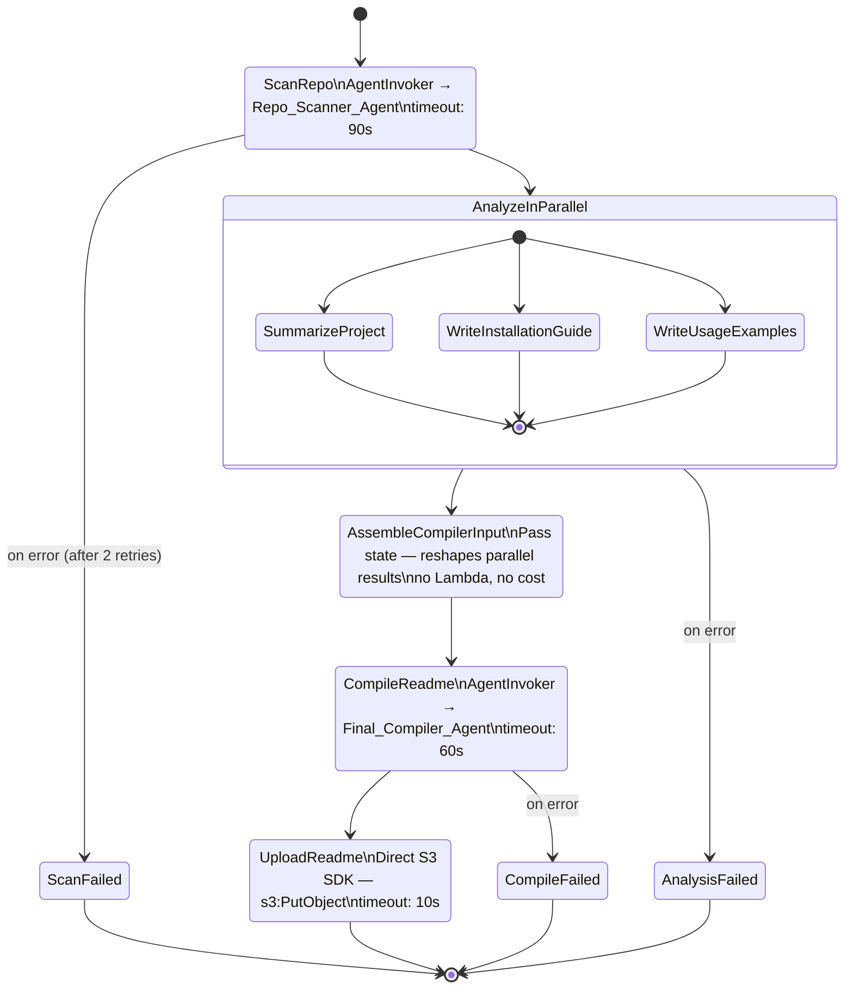
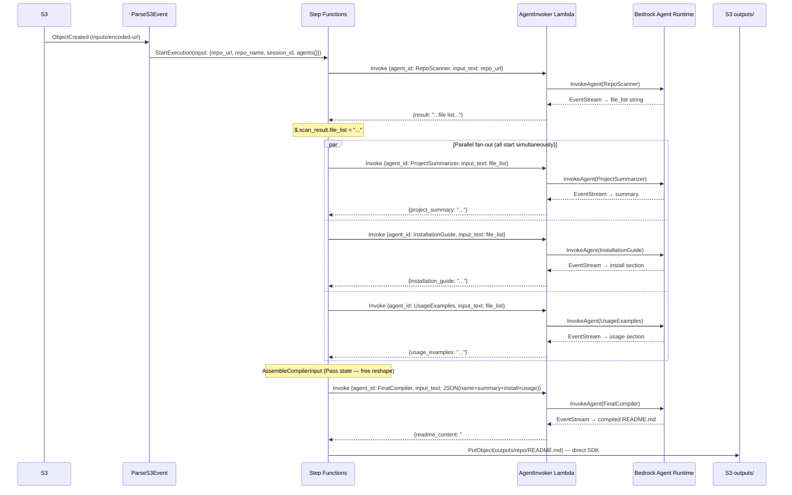

# Architecture Diagrams — Step Functions Refactor

## System Context (After Refactor)



---

## State Machine Flow (Express Workflow)



---

## Data Flow Through the State Machine



---

## Latency Comparison

```
Current (sequential):
  ScanRepo   ~50s  ████████████████████████████████████████████████████
  Summarize  ~25s                                          █████████████████████████
  Install    ~25s                                                                   █████████████████████████
  Usage      ~25s                                                                                          █████████████████████████
  Compile    ~25s                                                                                                                   █████████████████████████
  Total: ~150s  (close to 180s timeout)

After refactor (parallel fan-out):
  ScanRepo   ~50s  ████████████████████████████████████████████████████
  Parallel   ~25s                                          █████████████████████████
  (all 3 branches run at the same time)
  Compile    ~25s                                                                   █████████████████████████
  Total: ~100s  (50s saved, 44% faster)
```
